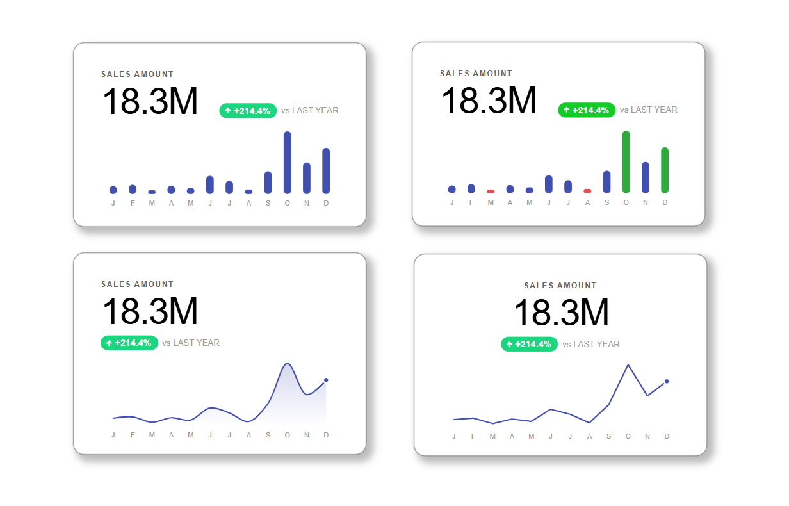

# development-sdk-power-bi_my-first-custom-visual
My answer to a community challenge by Elena Drakulevska and Phil Seamark. Turns out, the SDK isn't that scary.

# 📦 KPI Card Loa — Custom Visual for Power BI

A custom Power BI visual developed to explore **AI-assisted development with Claude Code** — and to build the tailored KPI card I always wanted but never found in AppSource. Built from scratch using the Power BI Visuals SDK, TypeScript, D3.js, and the Microsoft Learn MCP server for official documentation.



**Version:** 1.0.0 · **API:** Power BI 5.11.0 · **Released:** March 2026

## 🔗 Links

- 📌 [Live Demo in Power BI](https://app.powerbi.com/view?r=eyJrIjoiY2MwZWMxY2UtYmNhMy00ZGQ1LTk3YjUtYzZiNDViNWRiMTNhIiwidCI6IjEyYmMwNzYyLWZiOWEtNDFkNy1iODMyLWIzYWQ1OGE4YzRmOSIsImMiOjR9)

---

## 💡 Why I Built This

The native Power BI KPI card is limited. I needed a card that combined a KPI value, a pre-calculated delta with directional formatting, and a sparkline — all in one visual, with granular control over layout and style.

Rather than patching together three separate visuals, I built one. And I used it as an opportunity to explore a workflow I hadn't tried before: **vibe coding with Claude Code**, using the Microsoft Learn MCP server to pull official SDK documentation directly into the development context.

This is my first custom visual. It's also a study in how far AI-assisted development can take a Power BI developer with no prior TypeScript or SDK experience.

---

## 🎬 In Action

### Bar Sparkline — Default & Pill Style
KPI value with comparison badge. Toggle between plain colored text and pill style for the delta indicator.


### Line Sparkline — Smooth & Shadow
Smooth CatmullRom curve with area gradient. Hover tooltip calculated mathematically via mouse overlay — because a 1-2px SVG path can't be hovered directly.


### Mark Extremes
Highlights the top N and bottom N values in the sparkline with configurable colors. Useful for spotting peaks and dips at a glance.


### Layout Flexibility
Label position (top/bottom), comparison position (below value / beside value / beside label), and alignment (left/center/right) — fully configurable from the format panel.


---

## 🧩 What It Does

KPI Card Loa combines three elements in a single visual:

- A **KPI value** with customizable label and native conditional formatting (`fx` button on value color)
- A **comparison badge** with pre-calculated delta, directional arrow, pill style option, and invert direction for metrics where lower is better
- A **sparkline** in bar or line format, with tooltip hover, mark extremes, sort order, and dynamic format panel visibility based on chart type

---

## 🏗️ Architecture Decisions

**Delta as external measure, not calculated internally.**
The visual doesn't compute the delta. It expects a pre-calculated DAX measure (e.g. YoY variance). This gives the analyst full control over the comparison period without building that logic into the visual.

**Value and Trend Value as separate fields.**
KPI visuals often conflate the point-in-time value with the trend series. Separating them allows showing, for example, net sales YTD as the KPI while the sparkline shows gross sales month by month.

**D3 via npm, not CDN.**
D3 is bundled as a local dependency rather than loaded from a CDN. This ensures the visual works in offline environments and in Power BI's PDF/image export pipeline.

**DOM built with `createElement`, not `innerHTML`.**
Power BI's linter prohibits `innerHTML` as an XSS security measure. All DOM construction uses `createElement` / `appendChild`.

**`FormattingSettingsService` for format persistence.**
A manual `getFormattingModel()` with hardcoded values doesn't persist user changes — Power BI overwrites them with defaults on every render. `FormattingSettingsService.populateFormattingSettingsModel()` reads saved values from the `dataView` automatically.

---

## 🛠️ Development Stack

| Tool | Role |
|---|---|
| Power BI Visuals SDK (`pbiviz`) | CLI and build pipeline |
| TypeScript 5.5.4 | Visual logic |
| D3.js ^7.9.0 | Sparkline rendering |
| `powerbi-visuals-api` 5.11.0 | Official Power BI API |
| `powerbi-visuals-utils-formattingmodel` 6.0.4 | Format panel persistence |
| Claude Code | AI-assisted development |
| Microsoft Learn MCP | Official SDK documentation in context |
| VS Code | Development environment |

---

## 📁 Project Structure

```
kPICardLoa/
├── src/
│   ├── visual.ts          # Core visual logic
│   └── settings.ts        # Format model (FormattingSettingsService)
├── style/
│   └── visual.less        # Styles
├── capabilities.json      # Data roles and format properties
├── pbiviz.json            # Visual metadata
├── package.json           # Dependencies
└── tsconfig.json          # TypeScript config
```

---

## 🔌 Data Fields

| Field | Role | Type | Notes |
|---|---|---|---|
| **Category** | `category` | Dimension | X axis for sparkline. Accepts date or text columns. Does not accept measures. |
| **Value** | `measure` | Measure | Main KPI value. Visual takes the last value in the series. |
| **Delta** | `deltaMeasure` | Measure | Pre-calculated ratio (0.214 = 21.4%). Must come from the semantic model. |
| **Trend Value** | `trendMeasure` | Measure | Sparkline series. Can differ from Value (e.g. monthly gross sales vs. net YTD). |

---

## ⚙️ Format Panel Reference

<details>
<summary><strong>Content</strong></summary>

| Property | Type | Default | Description |
|---|---|---|---|
| Label | Text | "SALES AMOUNT" | Card title |
| Value color | Color (fx) | #1a1a1a | Supports native Power BI conditional formatting |
| Conditional color | Toggle | Off | Reserved for threshold-based color logic (v1.1.0) |

</details>

<details>
<summary><strong>Comparison</strong></summary>

| Property | Type | Default | Description |
|---|---|---|---|
| Show | Toggle | On | Show/hide comparison section |
| Label | Text | "LAST YEAR" | Reference period label (appears as "vs LAST YEAR") |
| Positive color | Color | #2563eb | Color when delta > 0 |
| Negative color | Color | #dc2626 | Color when delta < 0 |
| Neutral color | Color | #6b7280 | Color when delta = 0 |
| Invert direction | Toggle | Off | Flips positive/negative logic. For metrics where lower is better (costs, complaints) |
| Pill style | Toggle | Off | Colored background pill instead of plain colored text |

</details>

<details>
<summary><strong>Trend — General</strong></summary>

| Property | Type | Default | Description |
|---|---|---|---|
| Show | Toggle | On | Show/hide sparkline |
| Chart type | Dropdown | Bar | Switches between bar and line. Format panel shows/hides Bar/Line option groups dynamically |
| Color | Color | #3b82f6 | Main sparkline color |
| Height (px) | Number | 80 | Sparkline height in pixels |
| X axis labels | Toggle | Off | Shows first letter of each category as X axis label |
| Tooltip on hover | Toggle | On | Tooltip with label and value on sparkline hover |
| Sort order | Dropdown | As is | "As is" / "Ascending" / "Descending" |
| Mark extremes | Toggle | Off | Highlights top N and bottom N values |
| Extremes N | Number | 2 | Number of values to highlight at each extreme |
| Top color | Color | #16a34a | Color for top N values |
| Bottom color | Color | #dc2626 | Color for bottom N values |

</details>

<details>
<summary><strong>Trend — Bar options</strong> <em>(visible when Chart type = Bar)</em></summary>

| Property | Type | Default | Description |
|---|---|---|---|
| Bar style | Dropdown | Rounded | Rounded or Square corners |
| Corner radius (%) | Number | 30 | Rounding percentage when Bar style = Rounded |
| Bar padding | Number | 25 | Space between bars (0–100 scale) |

</details>

<details>
<summary><strong>Trend — Line options</strong> <em>(visible when Chart type = Line)</em></summary>

| Property | Type | Default | Description |
|---|---|---|---|
| Smooth line | Toggle | On | CatmullRom curve. Off = straight segments |
| Shadow | Toggle | On | Area gradient below the line |

</details>

<details>
<summary><strong>Layout</strong></summary>

| Property | Type | Default | Description |
|---|---|---|---|
| Alignment | Dropdown | Left | Left / Center / Right. Center and Right only work when Comparison position = "Below value" |
| Label position | Dropdown | Top | Label above or below the KPI value |
| Comparison position | Dropdown | Below value | Below value / Beside value / Beside label |

</details>

---

## 🧱 Known Limitations

**Conditional color toggle** — The toggle exists in the format panel but has no functional implementation. Threshold-based color rules are on the v1.1.0 roadmap. The native `fx` button on Value color does work for field-based conditional formatting.

**Alignment with Beside positions** — When Comparison position is "Beside value" or "Beside label", alignment is forced to Left. The format panel may show the previous value but the visual renders Left. Expected behavior, but potentially confusing.

**Sort order + X axis labels** — Labels are reordered alongside data, showing the first letter of the reordered category. May not match expected label order.

**Value takes last data point** — The visual always displays the last value in the dataView column. If Power BI delivers data in an unexpected order, the displayed value may not correspond to the latest period.

**100-category limit** — `dataReductionAlgorithm` in `capabilities.json` caps the sparkline at 100 data points.

---

## 🗺️ Roadmap — v1.1.0

### Visual functionality
- [ ] Conditional color — threshold-based rules (red if < X, green if > Y)
- [ ] Configurable number format (currently hardcoded K/M/B)
- [ ] Configurable font size for label and value

### Microsoft-recommended features
- [ ] **Rendering Events** — critical for PDF/image export reliability
- [ ] **Color Palette** — respect report theme colors instead of hardcoded defaults
- [ ] **Landing Page** — empty state when no data is connected
- [ ] **Allow Interactions** — react to cross-visual filters
- [ ] **Context Menu** — native right-click with drill-through and export options
- [ ] **High Contrast** — Windows high contrast accessibility mode
- [ ] **Keyboard Navigation** — full keyboard accessibility
- [ ] **Native Tooltips** — replace custom tooltip with Power BI's native tooltip system
- [ ] **Selection Across Visuals** — cross-visual selection support
- [ ] **Localizations** — multi-language support

---

## 💬 Development Notes — Vibe Coding with Claude Code

This visual was built entirely through AI-assisted development. No prior TypeScript or Power BI SDK experience. Here's what actually worked and what didn't.

### What worked

**HTML prototype first.** Before touching the SDK, I built a full replica in HTML/CSS/JS in the browser. Around 60-70% of the SVG/D3 code transferred directly into `visual.ts`. Validating design and interactivity in the browser before dealing with the Power BI compile cycle saved roughly 20 hours of development.

**Claude Code for SDK-specific patterns.** The Power BI Visuals SDK has sparse documentation and many non-obvious gotchas — especially around format persistence, TypeScript types, and the `capabilities.json` structure. Using Claude Code with the Microsoft Learn MCP server to pull official documentation into context made iterating on those parts significantly faster than reading docs manually.

### SDK gotchas worth remembering

`innerHTML` is blocked by the Power BI linter as an XSS prevention measure. Rewrite all prototype code that used it with `createElement` / `appendChild`.

Format persistence requires `FormattingSettingsService`. A manual `getFormattingModel()` with hardcoded values will have every user change reverted on the next render — Power BI overwrites defaults on every `update()` call.

`displayName` is mandatory in `capabilities.json` at both the object level and property level. Without it, format values don't persist.

`fill: "none"` in SVG doesn't detect mouse events. For hover overlays, use `pointer-events: "all"` or `fill: "white"` + `opacity: 0`.

Close and reopen the `.pbix` after reimporting the visual. Power BI Desktop caches the previous visual build and won't reflect changes otherwise.

`CompositeCard` with `Group` is required for grouped properties in the format panel. `SimpleCard` doesn't support groups.

---

## 📋 Changelog

### v1.0.0 — MVP (March 2026)
- KPI value with customizable label and native conditional formatting (`fx`)
- Comparison badge: directional arrow, pill style, invert direction
- Sparkline bar (rounded/square, corner radius, padding) and line (smooth, shadow)
- Tooltip hover on bars and line
- Mark extremes (top N / bottom N with configurable colors)
- Layout: alignment, label position, comparison position
- Dynamic format panel visibility by chart type
- Format persistence via `FormattingSettingsService`
- Sort order: as is / ascending / descending

---

*Built with the Power BI Visuals SDK, TypeScript, D3.js, Claude Code, and the Microsoft Learn MCP server.*  
*Author: Loana Ibañez — [datavizargentina.com.ar](https://datavizargentina.com.ar)*
